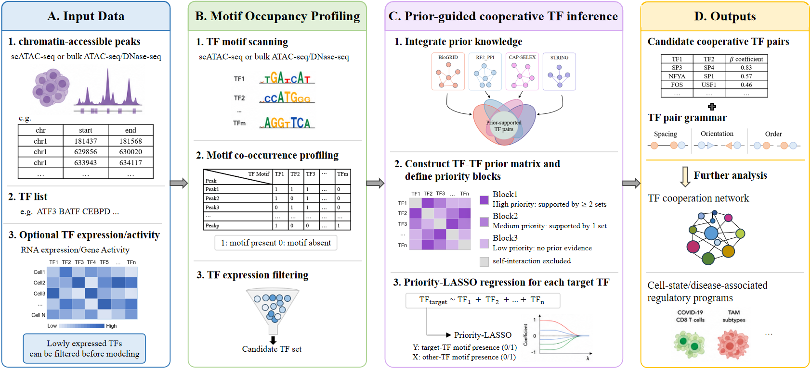

# PROACT: Prior-Regularized Optimization for Analysis of Co-occurring TFs

**PROACT** is an R package for inferring candidate cooperative transcription factor (TF) pairs from chromatin accessibility and motif occupancy data. PROACT integrates multi-source TF-pair prior evidence with priority-LASSO regression and provides downstream tools for TF cooperation network visualization and spatial TF-pair grammar analysis.

{fig-align="center" width="95%"}


## Overview

PROACT is designed for both single-cell and bulk chromatin accessibility data, including scATAC-seq, bulk ATAC-seq, and DNase-seq. The workflow starts from selected chromatin-accessible regions and motif occupancy information, optionally incorporates TF expression or activity filtering, and models the motif occupancy of each target TF using the occupancy of other TFs.

Prior knowledge is used to define predictor priorities rather than to directly determine the final TF pairs. PROACT currently integrates four prior sources:

- **BioGRID**
- **STRING**
- **RF2PPI**
- **CAP-SELEX**

TF pairs supported by at least two prior sources are assigned to the highest-priority block, pairs supported by one source are assigned to the second-priority block, and pairs without prior evidence are retained in a lower-priority block. This allows PROACT to use existing knowledge while still permitting the discovery of candidate TF cooperation without prior support.

The main outputs include:

- candidate cooperative TF pairs and their regression coefficients;
- prior annotation for inferred TF pairs;
- TF cooperation networks;
- motif spacing, orientation, and order for TF-pair grammar analysis;
- pair-level grammar summaries such as spacing entropy and arrangement entropy.

> **Interpretation note:** A positive PROACT coefficient represents a positive conditional association between TF motif occupancies. It should not, by itself, be interpreted as direct evidence of a physical TF-TF interaction or causal regulation.

## Workflow

The PROACT workflow consists of four major stages:

1. **Input data**
   - chromatin-accessible peaks;
   - candidate or target TFs;
   - optional TF expression or activity information.

2. **Motif occupancy profiling**
   - TF motif scanning;
   - motif co-occurrence profiling across accessible peaks;
   - optional expression/activity-based TF filtering.

3. **Prior-guided cooperative TF inference**
   - integration of multi-source TF-pair prior evidence;
   - construction of the TF-TF prior matrix and priority blocks;
   - priority-LASSO regression for each target TF.

4. **Downstream analysis**
   - candidate cooperative TF pairs;
   - TF-pair grammar;
   - TF cooperation networks;
   - context-specific regulatory programs.

## Installation

PROACT requires **R >= 4.1.0**.

To install the development version from GitHub:

```r
if (!requireNamespace("remotes", quietly = TRUE)) {
    install.packages("remotes")
}

remotes::install_github("hdm2020/PROACT")
```

To install a locally built source package:

```r
install.packages(
    "PROACT_0.1.0.tar.gz",
    repos = NULL,
    type = "source"
)
```

After installation:

```r
library(PROACT)
```

## Prior data

The prior TF-pair databases are supplied by the user and are not bundled with PROACT. The directory passed to `build_prior()` should contain the following files:

```text
PPI_data/human/
├── BioGRID.tsv
├── STRING.tsv
├── RF2PPI.tsv
└── CAPSELEX.tsv
```

We provide these files at data/PPI_data/human.zip. The JASPAR motif-to-TF annotation used internally by PROACT is bundled with the package as `extdata/metadata.tsv`.

## Quick Start

The example below shows the core PROACT workflow after a peak-by-motif matrix, a set of selected accessible peaks, and target TFs have been prepared.

```r
library(PROACT)
data("PROACT_example")

#Prepare the binary peak-by-TF matrix
#Expression/activity filtering is optional. To retain all TFs, set `filter_expr = FALSE`
peak_tf <- prepare_peak_tf_matrix(
    peak_motif_mat = PROACT_example$peak_motif,
    da_peaks = PROACT_example$da_peaks,
    filter_expr = TRUE,
    expr_tfs = PROACT_example$expressed_tfs
)

#Infer candidate cooperative TF pairs
result <- run_PROACT(
    peak_tf_matrix = peak_tf,
    prior_mat = PROACT_example$prior_mat,
    target_tfs = PROACT_example$target_tfs,
    ncores = 1
)

head(result)
```

## Main functions

PROACT exposes eight main functions:

| Function | Description |
|---|---|
| `build_prior()` | Build the multi-source TF-TF prior matrix |
| `prepare_peak_tf_matrix()` | Convert peak-by-motif data into a binary peak-by-TF matrix |
| `run_PROACT()` | Infer candidate cooperative TF pairs using prior-guided priority LASSO |
| `find_grammar()` | Identify motif spacing, orientation, and order for TF pairs |
| `analyze_tf_grammar()` | Test spacing and orientation preferences |
| `summarize_tf_grammar()` | Summarize pair-level grammar features |
| `plot_tf_grammar()` | Visualize the spatial grammar of a selected TF pair |
| `plot_PROACT_network()` | Visualize the inferred TF cooperation network |

## Tutorials

Four application tutorials are provided to demonstrate PROACT across different chromatin accessibility settings:

- **Human PBMC scATAC-seq** — cell-type-specific cooperative TF inference.
- **COVID-19 PBMC scATAC-seq** — condition-specific TF cooperation in mild and severe disease states.
- **Pan-cancer CAF scATAC-seq** — cooperative TF inference in Myo_CAFs and related stromal states.
- **Bulk DNase-seq** — application to HCT116 and HEK293T bulk chromatin accessibility data.

Tutorial website:

> **[PROACT Tutorials](https://hdm2020.github.io/PROACT/)**

## Input requirements

### Peak-by-motif matrix

The peak-by-motif input should contain:

- one `peakID` column;
- one column per motif;
- non-zero values indicating motif presence.

PROACT maps motif IDs to TF names, binarizes motif occupancy, removes low-frequency TFs, and optionally filters TFs using expression or activity information.

### Target TFs

`target_tfs` defines the TFs used as response variables in PROACT models. Target TFs may be selected using motif enrichment, prior biological knowledge, or another analysis appropriate to the dataset.

### Optional expression/activity filtering

Depending on the dataset, TF filtering can be based on:

- scRNA-seq expression;
- bulk RNA expression;
- gene activity or gene scores derived from chromatin accessibility.

This step is optional and is controlled by `filter_expr` and `expr_tfs` in `prepare_peak_tf_matrix()`.

## Citation

If you use PROACT in your research, please cite the associated manuscript:

> **Citation information will be added upon publication.**

## License

Please see the `LICENSE` file in the PROACT repository for license information.
